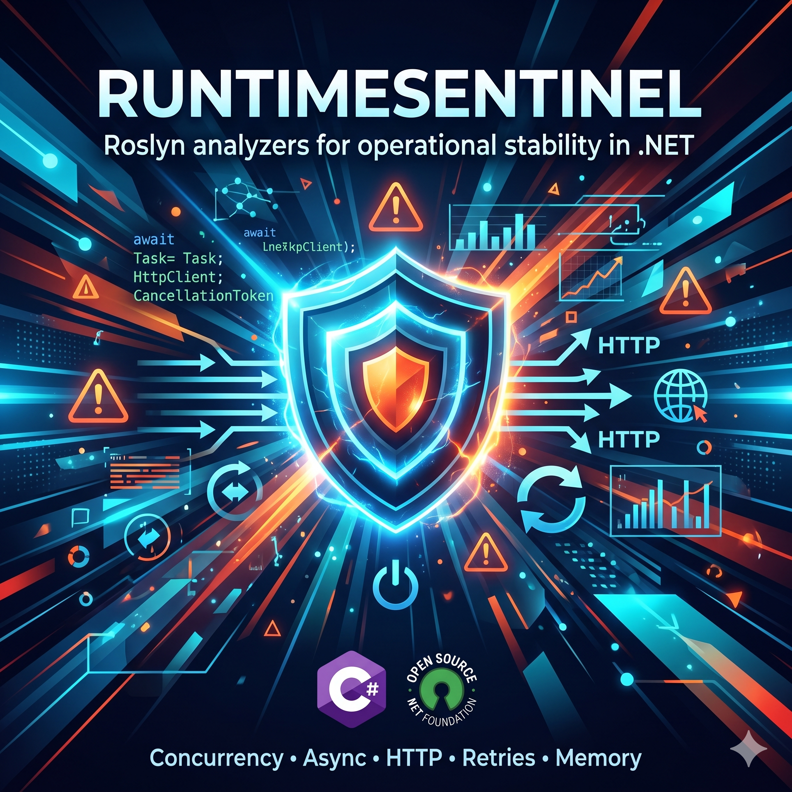

<p align="center">
  
</p>

<p align="center">
  <a href="https://www.nuget.org/packages/RuntimeSentinel.Analyzers"></a>
  
  
  
</p>

<p align="center">
  <strong>Toolkit de analyzers Roslyn para estabilidade operacional em .NET.</strong><br/>
  Detecte riscos de concorrência, async, memória e HTTP em tempo de compilação — antes de chegarem à produção.
</p>

<p align="center">
  🇺🇸 <a href="README.md">English version</a>
</p>

---

## Por Que o RuntimeSentinel

A maioria dos analyzers estáticos cobre bem estilo e corretude. Riscos operacionais — problemas de concorrência, tempestade de retries, pressão de memória sob carga — costumam aparecer tarde: em testes de carga ou incidentes em produção.

O RuntimeSentinel antecipa essa detecção tornando riscos de alto impacto em tempo de execução visíveis **em tempo de compilação**, no IDE e em pipelines de CI. Sem ferramentas extras, sem overhead em runtime — apenas avisos onde você escreve código.

| | |
|---|---|
| ⚡ Estabilidade sob carga | 🔒 Concorrência segura |
| 📡 Padrões HTTP resilientes | 🧠 Eficiência de memória |
| ⏱ Throughput previsível | 🔁 Segurança em retries |

## Regras Implementadas

| Regra | Categoria | O que analisa | Por que importa |
|---|---|---|---|
| RS1001 | Concurrency | `Thread.Sleep` dentro de método `async` | Bloqueia threads reais; sob carga isso satura o thread pool |
| RS1002 | Concurrency | `Task.WhenAll` com fan-out sem limite explícito | Fan-out sem bound pode inundar dependências downstream |
| RS1003 | Concurrency | `Parallel.ForEach` sem `MaxDegreeOfParallelism` | Pode fazer oversubscribe de CPU e saturar recursos compartilhados |
| RS1004 | Async | Chamadas bloqueantes `.Wait()` / `.Result` em contexto async | Bloqueia threads e eleva risco de deadlock/starvation |
| RS1005 | Memory | `ToList()` em query sem limite explícito | Pode gerar pico de memória e acionar GC sob carga |
| RS1006 | Communication | `new HttpClient()` criado dentro de método | Instanciação por chamada causa esgotamento de sockets ao longo do tempo |
| RS1007 | Communication | Chamada HTTP sem timeout explícito ou `CancellationToken` | Requisições podem ficar presas indefinidamente em picos de latência |
| RS1008 | Communication | Loop de retry sem limite máximo de tentativas | Retries infinitos amplificam carga sobre dependência já falhando |
| RS1009 | Communication | Retry com atraso fixo em vez de backoff exponencial | Intervalo fixo mantém requisições intensas sobre dependência instável |
| RS1010 | Communication | Backoff exponencial sem jitter | Retries sincronizados entre instâncias geram rajadas coordenadas |
| RS1011 | Async | Método `async void` fora de event handler | Exceções escapam da pilha de chamadas e encerram o processo; o chamador não pode aguardar nem tratar |
| RS1012 | Memory | `string +=` dentro de loop | Cada iteração aloca uma nova string na heap; use `StringBuilder` para evitar pressão no GC |

## Code Fix — RS1002

Para RS1002 (`Task.WhenAll` com fan-out ilimitado), o RuntimeSentinel inclui um code fix automático com duas estratégias:

**Antes:**
```csharp
var results = await Task.WhenAll(items.Select(i => ProcessAsync(i)));
```

**Depois — opção 1: limitar com `Take`:**
```csharp
var results = await Task.WhenAll(items.Take(100).Select(i => ProcessAsync(i)));
```

**Depois — opção 2: limitar concorrência com `SemaphoreSlim`:**
```csharp
var semaphore = new SemaphoreSlim(10);
var results = await Task.WhenAll(items.Select(async i =>
{
    await semaphore.WaitAsync();
    try { return await ProcessAsync(i); }
    finally { semaphore.Release(); }
}));
```

## Score de Risco Operacional

Além dos diagnósticos individuais, o RuntimeSentinel inclui um motor de pontuação que produz um **relatório composto de risco operacional** para um trecho de código C#.

```csharp
var scorer = new OperationalRiskScorer();
var report = await scorer.AnalyzeSourceAsync(sourceCode);

Console.WriteLine(report.OperationalRisk);      // 0-100
Console.WriteLine(report.OperationalRiskLevel);  // Low / Medium / High
Console.WriteLine(report.ToMarkdown());
Console.WriteLine(report.ToJson());
```

O relatório inclui:

| Campo | Descrição |
|---|---|
| `ConcurrencyRisk` | Score 0-100 para problemas de concorrência |
| `AsyncRisk` | Score 0-100 para bloqueios async |
| `MemoryRisk` | Score 0-100 para pressão de memória |
| `OperationalRisk` | Score composto ponderado (0-100) |
| `OperationalRiskLevel` | Classificação `Low` / `Medium` / `High` |
| `Findings` | Lista de diagnósticos individuais com localização |
| `Justifications` | Explicações legíveis por humanos para cada finding |

Pesos padrão: Concorrência `50%` · Async `30%` · Memória `20%`.  
Limiares: `Low < 30` · `30 ≤ Medium < 70` · `High ≥ 70`.

Pesos e limiares são configuráveis via `OperationalRiskScoringOptions`.

## Início Rápido

**Instalar via NuGet (recomendado):**

```bash
dotnet add package RuntimeSentinel.Analyzers
```

Ou adicionar diretamente ao seu `.csproj`:

```xml
<PackageReference Include="RuntimeSentinel.Analyzers" Version="0.1.3" />
```

Os avisos aparecem automaticamente no Visual Studio, VS Code (C# Dev Kit), Rider e pipelines de CI.

**Build a partir do código-fonte:**

```bash
git clone https://github.com/resolvendobug/RuntimeSentinel
dotnet build RuntimeSentinel.slnx
dotnet test test/RuntimeSentinel.Analyzers.Tests/RuntimeSentinel.Analyzers.Tests.csproj
```

## Compatibilidade

- Target framework: `netstandard2.0`
- Compatível com .NET Framework 4.6.1+, .NET Core 2.0+, .NET 5/6/7/8/9/10+
- Integra com qualquer IDE baseado em Roslyn (Visual Studio, VS Code com C# Dev Kit, Rider)

## Estrutura do Repositório

```
src/
  RuntimeSentinel.Analyzers/    Analyzers Roslyn (RS1001-RS1010)
  RuntimeSentinel.CodeFixes/    Code fixes automáticos para regras selecionadas
  RuntimeSentinel.Scoring/      Motor de score de risco operacional
test/
  RuntimeSentinel.Analyzers.Tests/  Suite de testes completa (36 testes)
samples/
  RuntimeSentinel.SampleApp/    Laboratórios práticos com exemplos das regras
```

## Escopo

O RuntimeSentinel é focado em análise de estabilidade operacional para C#/.NET — não é um linter de propósito geral.

Em escopo:
- Analyzers Roslyn de diagnóstico (RS1001–RS1010)
- Code fixes automáticos para regras selecionadas
- Motor de score de risco operacional com saída em JSON e Markdown

Fora de escopo na v1:
- Lint genérico de estilo ou convenções de nomenclatura
- Substituir testes de carga ou monitoramento em tempo de execução
- Funcionalidades completas de plataforma de observabilidade

## Contribuindo

Contribuições são bem-vindas!

1. Abra uma issue para discutir a mudança proposta
2. Faça fork do repositório e crie uma branch de feature
3. Adicione testes para novos analyzers ou fixes
4. Envie um pull request referenciando a issue

Se você tem um cenário de produção que gerou um incidente e seria uma boa nova regra, esse contexto é especialmente valioso.

## Licença

Este projeto usa a licença MIT. Veja [LICENSE](LICENSE).
